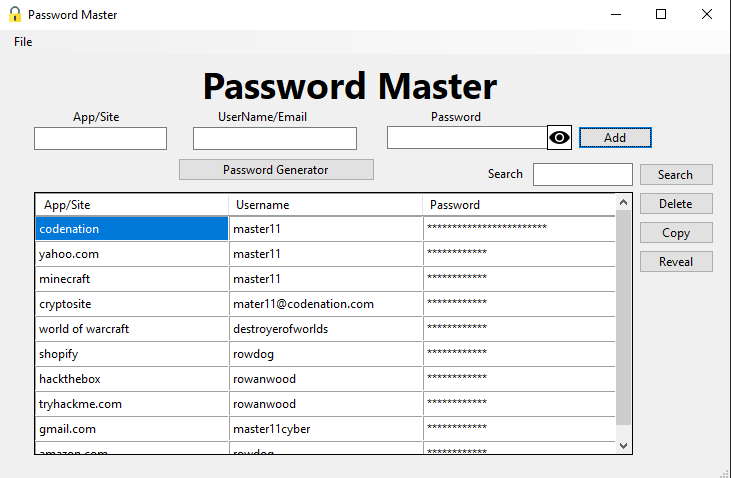

# PasswordMaster

## Description

This is a simple password manager that uses a master password to encrypt and decrypt passwords. It is written in C# and uses the .NET Framework 4.7.2.

## Requirements

Before running this application, please make sure you have the following prerequisites installed:

- [.NET 6.0](https://dotnet.microsoft.com/en-us/download/dotnet/6.0)

## Usage

### Adding a password

To add a password, enter the credentials and press Enter or the "Add" button. The password will be encrypted and saved to the database.

### Removing a password

To remove an account/password, select the password from the list and press the "Remove" button. The password will be removed from the database.

### Copying/revealing a password

To copy a password to the clipboard, select the password from the list and press the "Copy" button. The password will be copied to the clipboard. To reveal a password, select the password from the list and press the "Reveal" button. The password will be revealed in the password field.

### Generating a secure random password

To generate a secure random password, press the "Password Generator" button. A new window will appear. Enter the length of the password tick the box if you want to include special characters the special characters included can be removed from the inputbox below the checkbox. Press the "Generate" button to generate a password. Press the "Copy" button to copy the password to the clipboard. Press the "Close" button to close the window.

### Changing the master password

to change the master password select file on the menu bar and press the "Change Master Password" button. A new window will appear. Enter the old master password and the new master password. Press the "Change" button to change the master password. Press the "Close" button to close the window.

### Screenshots of the program

**Entering the master password**

**The main window**

**Generating a secure random password**

## Installation

### Windows

1. Download the latest release from the [releases](https://github.com/mrdiamonddirt/PasswordMaster/releases/tag/build) page.

2. Extract the zip file.

3. Run the PasswordManager.exe file.